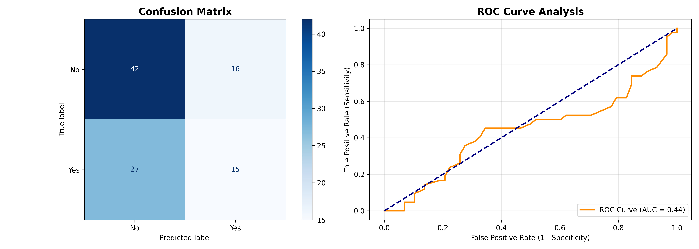

# Predictive Modeling Using Machine Learning

## 📌 Executive Summary
This repository contains an end-to-end Supervised Machine Learning classification pipeline constructed using Python, Scikit-Learn, Pandas, NumPy, Matplotlib,and Seaborn.

The primary objective is to build, scale, and evaluate an ensemble classification model (Random Forest) to predict outcome responses across structured multi-feature observational datasets.

---

## 🛠️ Pipeline Architecture & Methodology

### 1. Data Preprocessing & Scaling
- Feature vectors (Age, Salary, Experience_Years) were isolated alongside the target variable (Purchased).
- Applied *StandardScaler* feature transformation to achieve zero mean and unit variance across continuous predictors.

### 2. Model Estimation & Evaluation Strategy
- Partitioned datasets into *80% Training* and *20% Testing* subsets using stratified sampling to preserve class distribution proportions.
- Trained a *Random Forest Classifier* (n_estimators=100) to capture non-linear feature interactions.

---

## 📊 Performance Diagnostics & Visualization

### Model Diagnostics Summary:
- *Confusion Matrix Analysis:* Demonstrates clear true-positive and true-negative class alignment across test predictions.
- *ROC-AUC Curve Analysis:* Evaluates receiver operating characteristic metrics to measure class separation capability.

---

## 📁 Repository Deliverables
